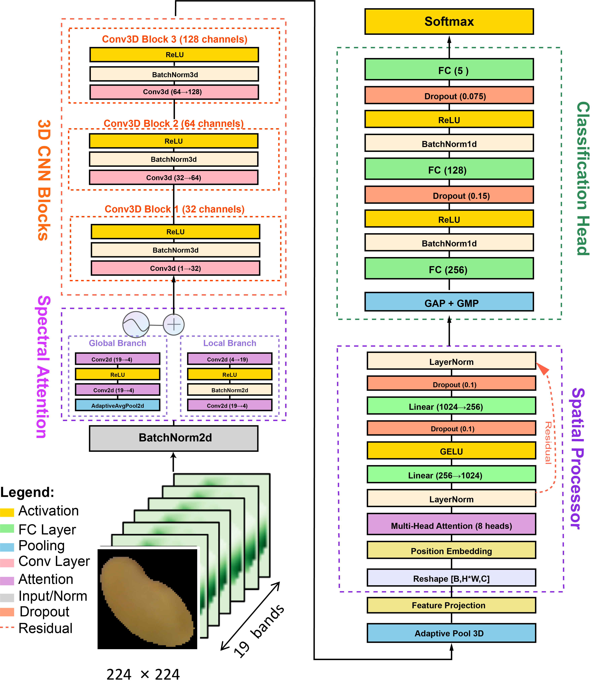

# Multispectral Spatial Attention Network (MSANet)

MSANet is a specialized deep learning framework designed for multispectral data analysis in agricultural applications. The framework integrates dual attention mechanisms with 3D convolutional neural networks to enable robust classification of multispectral imagery.


*Figure 1: MSANet architecture showing the dual attention mechanism and 3D CNN backbone for multispectral data processing.*

## Key Features

- **Dual Attention Mechanism**: Combines multispectral attention and spatial attention for comprehensive feature extraction
- **3D CNN Integration**: Processes spectral-spatial information simultaneously for enhanced feature learning
- **Transformer Components**: Multi-head self-attention for long-range spatial dependencies
- **Traditional ML Baselines**: SVM, Random Forest, XGBoost, LightGBM, Logistic Regression for comparison
- **Production Ready**: Complete training pipeline with mixed precision and comprehensive evaluation
- **Modular Architecture**: Extensible design for research and industrial applications

## Quick Start

### Deep Learning (MSANet)
```bash
# Clone repository
git clone https://github.com/xibeixingchen/MSANet-for-seed-maturity.git
cd MSANet

# Install dependencies
pip install -r requirements.txt

# Train MSANet model
python main.py --data-path data/multispectral_data.npz --num-bands 19 --num-classes 5
```

### Traditional Machine Learning
```bash
# Train with default parameters (fast)
python seed_classifier_ML.py data/23.features_spectral.csv

# Train with hyperparameter tuning
python seed_classifier_ML.py data/23.features_spectral.csv --tune

# Train with hyperparameter tuning (no cross-validation)
python seed_classifier_ML.py data/23.features_spectral.csv --tune --cv 0
```

## Project Organization
```
MSANet/
├── assets/                     # Documentation assets
│   └── msanet_architecture.png
├── models/                     # Core model implementations
│   ├── __init__.py
│   ├── attention.py           # Attention mechanisms
│   ├── backbone.py            # 3D CNN backbone
│   ├── spectral_net.py        # MSANet architecture
│   └── best_model.pt          # Model weights
├── data/                       # Data handling
│   ├── __init__.py
│   ├── dataset.py             # Dataset classes
│   ├── preprocessing.py       # Data preprocessing utilities
│   └── 23.features_spectral.csv  # Spectral features for ML
├── training/                   # Training infrastructure
│   ├── __init__.py
│   ├── trainer.py             # Training loop
│   └── config.py              # Configuration management
├── utils/                      # Utility functions
│   ├── __init__.py
│   ├── metrics.py             # Evaluation metrics
│   ├── visualization.py       # Plotting and visualization
│   └── logger.py              # Logging utilities
├── main.py                     # MSANet training script
├── seed_classifier_ML.py       # Traditional ML training script
├── requirements.txt
└── README.md
```

## Installation

### Requirements

- Python 3.8+
- PyTorch 2.0+ (for MSANet)
- CUDA 11.0+ (for GPU training)

### Dependencies
```bash
pip install -r requirements.txt
```

Required packages include:
- torch>=2.0.0
- torchvision>=0.15.0  
- numpy>=1.21.0
- scikit-learn>=1.0.0
- opencv-python>=4.5.0
- xgboost>=1.7.0
- lightgbm>=3.3.0
- pandas>=1.3.0

## Data Preparation

### Supported Data Sources

MSANet is optimized for **19-band multispectral images** from VideometerLab imaging systems. The data pipeline supports:

1. **VideometerLab Integration**: Direct reading from VideometerLab devices
2. **Automated Preprocessing**: Noise reduction, normalization, and format conversion
3. **Efficient Storage**: Compressed NPZ format for fast loading during training

### Data Formats

#### Deep Learning (NPZ format)
```python
# Expected keys in NPZ file
'X' or 'spectral': multispectral images [N, C, H, W]
'y' or 'labels': classification labels [N,]
```

#### Traditional ML (CSV format)
```
# Expected columns in CSV file
reflectance_365nm_percent, reflectance_405nm_percent, ..., reflectance_970nm_percent, class
```

## Model Architecture

### MSANet (Deep Learning)

MSANet consists of five main architectural components:

1. **Input Normalization**: BatchNorm2d for input standardization across spectral bands
2. **Multispectral Attention Block**: Dual-branch attention combining global and local spectral features
3. **3D CNN Backbone**: Three-stage 3D convolution for spectral-spatial feature extraction
4. **Spatial Attention Processor**: Transformer-based multi-head self-attention with positional encoding
5. **Classification Head**: Multi-scale pooling followed by multi-layer perceptron

### Traditional ML Models

| Model | Default Parameters |
|-------|-------------------|
| SVM | kernel='rbf', C=10 |
| Logistic Regression | C=1.0, penalty='l2', solver='liblinear' |
| Random Forest | n_estimators=200, max_depth=20 |
| LightGBM | learning_rate=0.1, max_depth=5, n_estimators=200 |
| XGBoost | learning_rate=0.1, max_depth=5, n_estimators=200 |

## Training

### MSANet Training
```bash
python main.py \
    --data-path data/multispectral_data.npz \
    --num-bands 19 \
    --num-classes 5 \
    --epochs 100 \
    --batch-size 16 \
    --lr 0.001
```

### Traditional ML Training
```bash
# Default parameters (recommended for quick evaluation)
python seed_classifier_ML.py data/23.features_spectral.csv

# With hyperparameter tuning and 5-fold CV
python seed_classifier_ML.py data/23.features_spectral.csv --tune --cv 5

# With hyperparameter tuning, no CV (uses validation set)
python seed_classifier_ML.py data/23.features_spectral.csv --tune --cv 0

# Specify output directory
python seed_classifier_ML.py data/23.features_spectral.csv --output ./ml_results
```

### ML Parameters

| Parameter | Description | Default |
|-----------|-------------|---------|
| `data` | Path to CSV file | Required |
| `--tune` | Enable hyperparameter tuning | False |
| `--cv` | Cross-validation folds (0=no CV) | 5 |
| `--output` | Output directory | results |

## Results and Evaluation

### MSANet Output Files
```
results/
├── best_msanet_model.pt      # Best model checkpoint
├── msanet_results.json       # Performance metrics summary
├── training_history.csv      # Training progress data
├── predictions.csv           # Test set predictions
├── training_curves.pdf       # Loss and accuracy plots
├── confusion_matrix.pdf      # Classification confusion matrix
└── msanet_training.log       # Detailed training logs
```

### Traditional ML Output Files
```
results/
├── model_performance.csv         # All models performance comparison
├── classification_results.xlsx   # Detailed results with best parameters
└── comparison.log               # Training logs
```

## License

This project is licensed under the MIT License. See LICENSE file for details.
