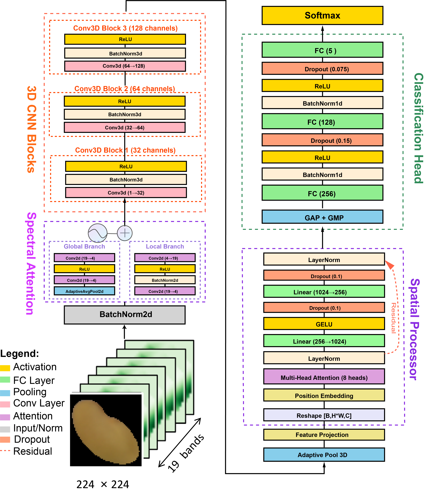

# Multispectral Spatial Attention Network (MSANet)

MSANet is a specialized deep learning framework designed for multispectral data analysis in agricultural applications. The framework integrates dual attention mechanisms with 3D convolutional neural networks to enable robust classification of multispectral imagery.


*Figure 1: MSANet architecture showing the dual attention mechanism and 3D CNN backbone for multispectral data processing.*

## Key Features

- **Dual Attention Mechanism**: Combines multispectral attention and spatial attention for comprehensive feature extraction
- **3D CNN Integration**: Processes spectral-spatial information simultaneously for enhanced feature learning
- **Transformer Components**: Multi-head self-attention for long-range spatial dependencies
- **Production Ready**: Complete training pipeline with mixed precision and comprehensive evaluation
- **Modular Architecture**: Extensible design for research and industrial applications

## Quick Start

```bash
# Clone repository
git clone https://github.com/xibeixingchen/MSANet-for-seed-maturity.git
cd MSANet

# Install dependencies
pip install -r requirements.txt

# Train model
python main.py --data-path data/multispectral_data.npz --num-bands 19 --num-classes 5
```

## Project Organization

```
MSANet/
├── assets/                     # Documentation assets
│   ├── msanet_architecture.png
├── models/                     # Core model implementations
│   ├── __init__.py
│   ├── attention.py           # Attention mechanisms
│   ├── backbone.py            # 3D CNN backbone
│   └── spectral_net.py        # MSANet architecture
│   └── best_model.pt          # model weights
├── data/                      # Data handling
│   ├── __init__.py
│   ├── dataset.py             # Dataset classes
│   └── preprocessing.py       # Data preprocessing utilities
├── training/                  # Training infrastructure
│   ├── __init__.py
│   ├── trainer.py             # Training loop
│   └── config.py              # Configuration management
├── utils/                     # Utility functions
│   ├── __init__.py
│   ├── metrics.py             # Evaluation metrics
│   ├── visualization.py       # Plotting and visualization
│   └── logger.py              # Logging utilities
├── main.py                    # Main training script
├── requirements.txt
└── README.md
```

## Installation

### Requirements

- Python 3.8+
- PyTorch 2.0+
- CUDA 11.0+ (for GPU training)

### Dependencies

```bash
pip install -r requirements.txt
```

Required packages include:
- torch>=2.0.0
- torchvision>=0.15.0  
- numpy>=1.21.0
- scikit-learn>=1.0.0
- opencv-python>=4.5.0
- videometer>=0.0.28 ([for VideometerLab data](https://github.com/Videometer/videometer-toolbox-python))

## Data Preparation

### Supported Data Sources

MSANet is optimized for **19-band multispectral images** from VideometerLab imaging systems. The data pipeline supports:

1. **VideometerLab Integration**: Direct reading from VideometerLab devices using the official Videometer Python library
2. **Automated Preprocessing**: Noise reduction, normalization, and format conversion
3. **Efficient Storage**: Compressed NPZ format for fast loading during training

### Data Format

Input data should be in NPZ format with the following structure:
```python
# Expected keys in NPZ file
'X' or 'spectral' or 'hyper': multispectral images [N, C, H, W]
'y' or 'labels' or 'targets': classification labels [N,] or [N, num_classes]
```

Where:
- N: number of samples
- C: number of spectral bands (19 for VideometerLab)
- H, W: spatial dimensions

## Model Architecture

### Core Components

MSANet consists of five main architectural components:

1. **Input Normalization**: BatchNorm2d for input standardization across spectral bands
2. **Multispectral Attention Block**: Dual-branch attention combining global and local spectral features
3. **3D CNN Backbone**: Three-stage 3D convolution for spectral-spatial feature extraction
4. **Spatial Attention Processor**: Transformer-based multi-head self-attention with positional encoding
5. **Classification Head**: Multi-scale pooling followed by multi-layer perceptron

### Attention Mechanisms

#### Multispectral Attention
- **Global Branch**: Adaptive pooling + channel-wise MLP for global spectral relationships
- **Local Branch**: 3×3 convolution + BatchNorm for local spatial-spectral patterns  
- **Adaptive Fusion**: Learnable parameter for optimal branch combination

#### Spatial Attention
- **Multi-head Self-attention**: 8-head attention for spatial dependency modeling
- **Position Encoding**: 2D positional embeddings for spatial structure preservation
- **Feed-forward Network**: GELU activation with residual connections

## Training

### Basic Training

```bash
python main.py \
    --data-path data/multispectral_data.npz \
    --num-bands 19 \
    --num-classes 5 \
    --epochs 100 \
    --batch-size 16
```

### Advanced Configuration

```bash
python main.py \
    --data-path data/multispectral_data.npz \
    --num-bands 19 \
    --num-classes 5 \
    --feature-dim 256 \
    --dropout-rate 0.15 \
    --spectral-attention-reduction 8 \
    --spatial-attention-heads 8 \
    --lr 0.001 \
    --weight-decay 0.01 \
    --patience 15 \
    --output-dir results/
```

### Parameters

| Parameter | Description | Default |
|-----------|-------------|---------|
| `--data-path` | Path to NPZ data file | Required |
| `--num-bands` | Number of spectral bands | 19 |
| `--num-classes` | Number of output classes | 5 |
| `--feature-dim` | Feature dimension | 256 |
| `--dropout-rate` | Dropout probability | 0.15 |
| `--batch-size` | Training batch size | 16 |
| `--epochs` | Maximum training epochs | 100 |
| `--lr` | Learning rate | 0.001 |
| `--patience` | Early stopping patience | 15 |

## Results and Evaluation

### Output Files

Training generates the following outputs in the specified directory:

```
results/
├── best_msanet_model.pt      # Best model checkpoint
├── msanet_results.json       # Performance metrics summary
├── training_history.csv      # Training progress data
├── predictions.csv           # Test set predictions
├── training_curves.pdf       # Loss and accuracy plots
├── confusion_matrix.pdf      # Classification confusion matrix
└── msanet_training.log       # Detailed training logs
```

### Evaluation Metrics

MSANet provides comprehensive evaluation using multiple classification metrics:

- **Accuracy Metrics**: Overall accuracy, balanced accuracy
- **Per-class Metrics**: Precision, recall, F1-score (weighted and macro averages)
- **Statistical Metrics**: Cohen's kappa coefficient, Matthews correlation coefficient
- **Confusion Analysis**: Per-class confusion matrix with visualization

## Applications

MSANet has been developed and validated for:

- **Agricultural Monitoring**: Crop health assessment, maturity evaluation
- **Seed Quality Analysis**: Automated seed grading and classification  
- **Climate-resilient Agriculture**: Performance under varying environmental conditions
- **Quality Control**: Industrial inspection of agricultural products

## Citation

If you use MSANet in your research, please cite:

```bibtex
@article{msanet2024,
  title={Climate-Resilient Evaluation of Alfalfa Seed Maturity Using an Earth Mover's Distance-Guided Multispectral Imaging Framework},
  author={Zhicheng Jia},
  journal={Under Peer Review},
  year={2024},
  note={Manuscript under review}
}
```

## License

This project is licensed under the MIT License. See LICENSE file for details.

## Contributing

Contributions are welcome through issues and pull requests. Please ensure code follows the existing style and includes appropriate tests.

## Acknowledgments

This research was conducted as part of climate-resilient agricultural monitoring systems development. MSANet represents advances in integrating attention mechanisms with 3D convolutional networks for enhanced multispectral data analysis in agricultural applications.

## Contact


For questions regarding MSANet implementation or agricultural applications, please open an issue on this repository.

